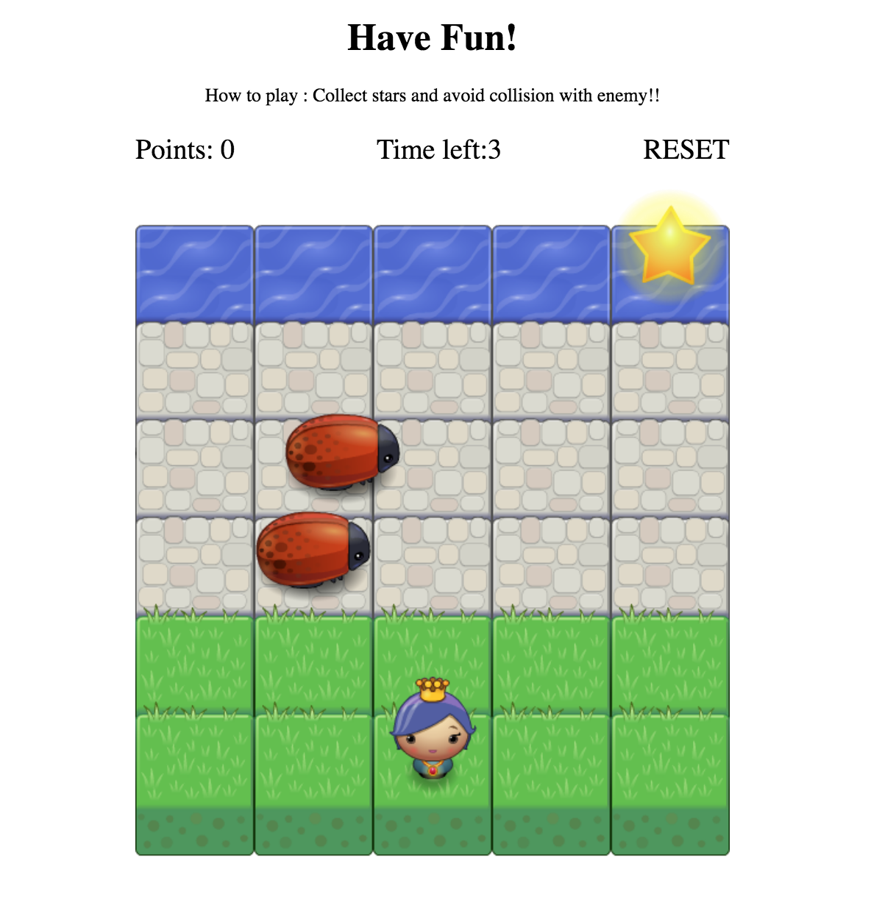

<!-- frontend-nanodegree-arcade-game
===============================

Students should use this [rubric](https://review.udacity.com/#!/projects/2696458597/rubric) for self-checking their submission. Make sure the functions you write are **object-oriented** - either class functions (like Player and Enemy) or class prototype functions such as Enemy.prototype.checkCollisions, and that the keyword 'this' is used appropriately within your class and class prototype functions to refer to the object the function is called upon. Also be sure that the **readme.md** file is updated with your instructions on both how to 1. Run and 2. Play your arcade game.

For detailed instructions on how to get started, check out this [guide](https://docs.google.com/document/d/1v01aScPjSWCCWQLIpFqvg3-vXLH2e8_SZQKC8jNO0Dc/pub?embedded=true). -->
# Arcade Game Project
Cross the road and collect the star. Careful, it is not that easy!!!

Example: 

## Table of Contents

* [How to play](#how-to-play)
* [Setting](#setting)

## How to play
* Simply open `index.html`.
* Select your favourite character.
* Click "START GAME" to start game.
* Cross the street and collect the star to earn as many points as you can within game time.
* Avoid collision with enemy (your character will be reset to the starting point when collides with an enemy).
* Click "RESTART" to restart your game at anytime. 

## Setting
* To set game time, change value of `const gametime` in `engine.js`
* To set enemy number, chage value of `const enemyCount` in `createEnemy()` in `app.js`
* To set enemy speed, change value of `const minSpeed` in `setSpeed()` in `app.js`
